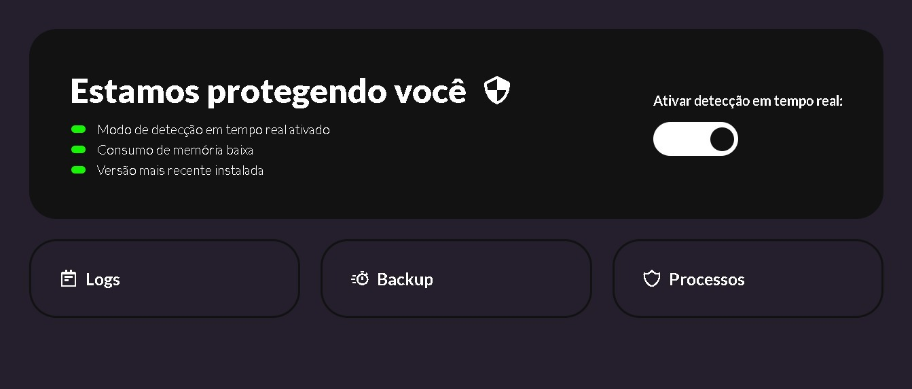
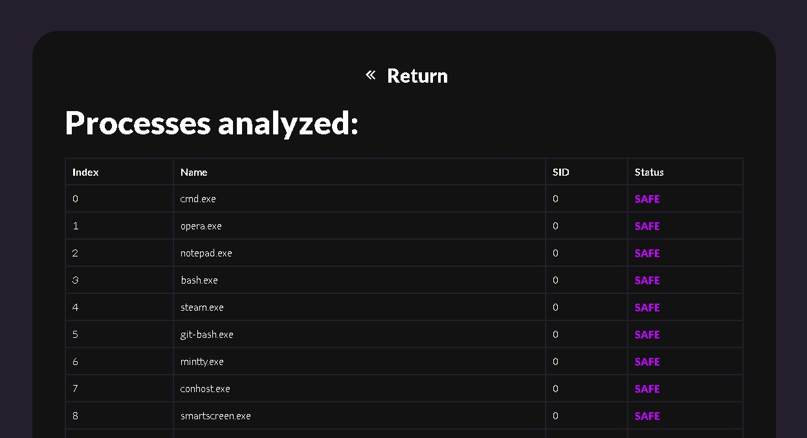

## Solução de Endpoint Detection and Response (EDR) otimizado para Windows -  PT-BR

O **Aégis Defender** é uma solução de segurança endpoint desenvolvida para proteger seu sistema contra a crescente ameaça dos ransomwares. Criado com Python e otimizado para sistemas Windows, nosso EDR incorpora algoritmos avançados de aprendizado de máquina, monitoramento em tempo real via WMI (Windows Management Instrumentation) e outras técnicas modernas de defesa em profundidade para oferecer proteção robusta e eficiente.

### Características Principais

- **Machine Learning para Detecção**: Utilizamos algoritmos de aprendizado de máquina para aprimorar a eficácia na detecção de ameaças, permitindo que o sistema se adapte às novas variantes de ransomware.
  
- **Monitoramento em Tempo Real via WMI**: O Aégis Defender faz uso do WMI para monitorar eventos de sistema em tempo real, aumentando nossa capacidade de detecção e resposta imediata a atividades maliciosas.

- **Verificação na Base de Dados JSON**: A base de dados JSON permite uma análise rápida e precisa de arquivos e processos, tornando o sistema mais abrangente que antivírus comuns.

## Pré-requisitos

Para garantir o funcionamento correto do Aégis Defender, é crucial que o ambiente onde ele será executado atenda a certas especificações. Os pré-requisitos abaixo são os mínimos recomendados, baseados em nossos ambientes de teste:

- **Memória**: 2GB de RAM (mínimo)
- **Processador**: 2 cores de CPU (mínimo)

### Sistema Operacional

- **Windows 10 x64**: A versão de 64 bits do Windows 10 é o sistema operacional suportado. É altamente recomendável manter o sistema atualizado com as últimas atualizações de segurança.

### Permissões

- **Acesso Administrativo**: O Aégis Defender requer privilégios de administrador para acessar recursos de sistema essenciais.

### Softwares Adicionais

- **Python Runtime**: É necessário ter Python instalado para executar o código.
- **Atualizações de Segurança**: Certifique-se de que todas as atualizações de segurança e patches estejam instalados.

Note que essas configurações foram as utilizadas em nossos ambientes de teste e servem como um ponto de partida. Configurações de hardware mais robustas são recomendadas para um melhor desempenho.

## Tecnologias

O Aégis Defender foi meticulosamente desenvolvido para operar no ambiente Windows 10, aproveitando as capacidades avançadas oferecidas pela linguagem de programação Python. Abaixo, você encontrará as tecnologias que compõem a espinha dorsal deste projeto:

### Sistema Operacional

- **Windows 10**: O Aégis Defender foi otimizado para operar no Windows 10, tirando vantagem das APIs e recursos nativos oferecidos por este sistema operacional.

### Linguagem de Programação

- **Python**: Linguagem escolhida por sua robustez e facilidade de integração com várias bibliotecas e APIs, permitindo uma rápida prototipagem e desenvolvimento.

### Bibliotecas

A seleção criteriosa de bibliotecas em Python amplifica as funcionalidades do Aégis Defender:

- **os, ctypes, sys**: Essas bibliotecas permitem uma integração profunda com o sistema operacional Windows.
- **psutil, wmi**: Empregadas no monitoramento em tempo real dos processos e eventos do sistema.
- **sklearn**: Implementa algoritmos de aprendizado de máquina para uma detecção de ameaças mais precisa.
- **json**: Encarregada do gerenciamento da base de dados JSON, que armazena informações cruciais.
- **webview, time**: Estas bibliotecas são utilizadas para a manipulação da interface de usuário e gerenciamento do tempo.
- **pathlib**: A biblioteca pathlib oferece uma maneira mais conveniente e orientada a objetos de trabalhar com caminhos de arquivos e diretórios no sistema de arquivos, tornando mais fácil a manipulação e navegação nos caminhos.
- **pythoncom**: A biblioteca pythoncom é usada principalmente para integração com componentes COM (Component Object Model) no Windows, permitindo a comunicação entre objetos de software através da infraestrutura COM.
- **threading**: A biblioteca threading é usada para criar e gerenciar threads em um programa Python. Isso é útil para realizar tarefas concorrentes ou paralelas, melhorando o desempenho e a eficiência em programas que exigem processamento simultâneo.
- **subprocess**: A biblioteca subprocess é usada para criar processos secundários ou subprocessos a partir de um programa Python. Ela é útil para executar comandos do sistema operacional, interagir com outros programas e capturar a saída desses programas.
- **flask**: Flask é um micro-framework web leve para Python. Ele é usado para criar aplicativos web e APIs de forma rápida e fácil. Flask é conhecido por sua simplicidade e extensibilidade, sendo uma escolha popular para o desenvolvimento web em Python.

### Frameworks e APIs

- **Flask**: Este micro-framework é utilizado para desenvolver uma interface web que permite uma fácil interação com o Aégis Defender.
- **MITRE ATT&CK**: Utilizamos as diretrizes e práticas recomendadas do MITRE ATT&CK para melhorar a segurança.
- **Google APIs**: Permite integrações com serviços do Google para funcionalidades adicionais.
- **Boxicons API**: Essa API é empregada para a inclusão de ícones vetoriais em aplicações web, aprimorando a experiência do usuário com elementos visuais de alta qualidade.

## Instalação

### Como baixar nosso aplicativo através do site Aégis Defender

Se você está interessado em baixar e experimentar nosso aplicativo, siga as instruções abaixo para uma experiência tranquila e descomplicada:

1. **Acesse o site**: Primeiro, visite o site do [Aégis Defender](https://aegis.avalontech.net.br). Nosso site foi otimizado para ser fácil de navegar e é compatível com todos os navegadores modernos.
2. **Navegue até o botão de download**: Em nossa página inicial, você encontrará um botão claramente marcado como "Download" ou "Baixar". Este botão foi projetado para ser visível e de fácil acesso.
3. **Inicie o download**: Uma vez que você clique no botão de download, o processo de baixar o arquivo começará automaticamente. Depende da velocidade da sua conexão com a internet, mas, geralmente, leva apenas alguns minutos.
4. **Siga as instruções de instalação**: Após o download ser concluído, abra o arquivo baixado e siga as instruções na tela para instalar nosso aplicativo em seu dispositivo.

Agradecemos por escolher nosso aplicativo e esperamos que você tenha uma excelente experiência ao usá-lo!

## Uso

### Funcionalidades:

1. **Detecção em Tempo Real**:
    - **Como usar**: Após abrir o programa, localize e clique no botão "Iniciar Detecção em Tempo Real".

        

    - **Descrição**: Esta função permite que o software monitore e identifique ameaças ou atividades não usuais em tempo real, garantindo maior segurança para seu sistema.

        

    -**Recomendação**: É aconselhável manter esta função sempre ativada para uma proteção constante.

2. **Logs**:
    - **Ainda em desenvolvimento!**

3. **Backup**:
    - **Ainda em desenvolvimento!**

4. **Processos**:
    - **Como usar**: Selecione "Processos" no menu. Aqui, você verá uma lista de todos os processos em execução.
    - **Descrição**: Esta função permite visualizar e gerenciar todos os processos ativos no seu sistema.
    - **Dica**: Se notar algum processo desconhecido ou suspeito, investigue ou encerre-o para garantir a segurança do seu sistema.

        

## Avaliações e Testes

- **Metodologia Rigorosa de Testes**: O Aégis Defender foi meticulosamente avaliado mediante metodologias padronizadas e testes rigorosos, garantindo sua capacidade de defesa e resposta.

    1. **Resiliência a Ransomwares**: Parte integral dos testes de avaliação, o Aégis Defender foi submetido a cenários adversos envolvendo alguns dos ransomwares mais notórios no cenário de ameaças cibernéticas. Esta bateria de testes incluiu ameaças como o Wannacry e o Jigsaw, dentre outros. O sucesso obtido diante dessas ameaças é um testemunho da robustez, competência e eficácia da nossa solução.

    2. **Compromisso com a Segurança**: Além dos testes específicos contra ransomwares, o Aégis Defender passa por uma série contínua de avaliações para garantir que mantém sua efetividade frente à evolução constante das ameaças. A cada atualização ou refinamento do software, novos testes são conduzidos para certificar-se de que o nível de proteção oferecido está alinhado às melhores práticas e padrões da indústria.

- **Dedicação à Excelência**: A dedicação incansável da equipe por trás do Aégis Defender é refletida na meticulosidade dos testes realizados e na constante busca por aperfeiçoamento, garantindo aos usuários uma ferramenta confiável e de alta performance.

## Autores

- **Equipe Aégis Defender**: O Aégis Defender representa um marco na segurança cibernética, fruto da colaboração e dedicação de três profissionais distintos:

    - **Júlia Barboza Brunelli**
        - [GitHub](https://github.com/Aykie)
        - [LinkedIn](https://www.linkedin.com/in/aykie/)

    - **Nicholas Calegari Sanches**
        - [GitHub](https://github.com/NCalegariS)
        - [LinkedIn](https://www.linkedin.com/in/nicholas-calegari-258823242/)
        
    - **Renan Dias da Costa Silva**
        - [GitHub](https://github.com/WHrez1ns)
        - [LinkedIn](https://www.linkedin.com/in/renan-dias-da-costa-563830264/)

Cada integrante da equipe contribuiu significativamente para a concepção, design e desenvolvimento deste projeto, consolidando sua relevância no panorama atual de segurança cibernética.

## Agradecimentos

À medida que a evolução digital avança, os desafios no campo da segurança cibernética tornam-se ainda mais intrincados. Dentro desse cenário complexo, a concepção e a realização do Aégis Defender são frutos da combinação sinérgica entre talento, dedicação e colaboração interdisciplinar. Por isso, consideramos imprescindível reconhecer e agradecer a todos que participaram dessa empreitada conosco.

- **Professores da FIAP**: Nos corredores acadêmicos e salas de aula da FIAP, encontramos um ambiente de fomento ao pensamento crítico e inovação. Agradeço aos professores que, com profundo conhecimento e vasta experiência, forneceram orientações precisas, moldando assim a base teórica e prática do Aégis Defender.

- **Pride Security**: Em um mercado tão competitivo e dinâmico, confiar em jovens talentos e desafiar os limites convencionais é uma postura louvável. A Pride Security não apenas nos propôs um desafio, mas também se tornou parte integral do nosso processo de aprendizado e desenvolvimento.

- **Avalon Tech**: A colaboração com a Avalon Tech foi de suma importância para dar vida ao Aégis Defender, e agradecemos o apoio ao projeto.

A jornada do Aégis Defender é testemunha do poder da colaboração. Assim, com humildade e respeito, agradecemos a cada indivíduo e instituição que nos apoiou, direta ou indiretamente, e confiou na nossa visão. Estamos no início de uma trajetória que, esperamos, contribuirá significativamente para a segurança digital.

## Assistência e Suporte Técnico

- **Canais de Comunicação** : Estamos comprometidos em oferecer um suporte eficiente e ágil aos usuários do Aégis. Se você encontrar dificuldades, tiver dúvidas sobre a aplicação ou precisar de orientação técnica:

    1. **Página de Contato**: A primeira opção é visitar a nossa [página de contato no site da Avalon Tech](https://avalontech.net.br/contact.php), onde disponibilizamos um formulário para dúvidas e sugestões.
    
    2. **E-mail**: Para um suporte mais direto, não hesite em nos enviar um e-mail. A nossa equipe de suporte técnico está sempre pronta para auxiliar e responderá sua mensagem o mais breve possível.
    
    3. **Documentação**: Recomendamos também a consulta à nossa documentação extensiva, onde muitas questões comuns são abordadas e esclarecidas.

Esperamos que estas vias de comunicação facilitem sua experiência com o Aégis e garantam a resolução de qualquer inquietação ou obstáculo que possa surgir.

## Optimized Endpoint Detection and Response (EDR) Solution for Windows - ENG

The **Aégis Defender** is an endpoint security solution designed to protect your system against the growing threat of ransomware. Built with Python and optimized for Windows systems, our EDR incorporates advanced machine learning algorithms, real-time monitoring via WMI (Windows Management Instrumentation), and other modern deep defense techniques to offer robust and efficient protection.

### Key Features

- **Machine Learning for Detection**: We use machine learning algorithms to enhance threat detection efficacy, allowing the system to adapt to new ransomware variants.
  
- **Real-Time Monitoring via WMI**: The Aégis Defender utilizes WMI to monitor system events in real-time, enhancing our detection capabilities and offering immediate response to malicious activities.

- **JSON Database Verification**: The JSON database allows for swift and accurate analysis of files and processes, making the system more comprehensive than standard antivirus solutions.

## Prerequisites

To ensure the proper functioning of the Aégis Defender, it is crucial that the environment in which it will be executed meets certain specifications. The prerequisites below are the minimum recommendations, based on our test environments:

- **Memory**: 2GB RAM (minimum)
- **Processor**: 2 CPU cores (minimum)

### Operating System

- **Windows 10 x64**: The 64-bit version of Windows 10 is the supported operating system. It is highly recommended to keep the system up-to-date with the latest security updates.

### Permissions

- **Administrative Access**: Aégis Defender requires administrator privileges to access essential system resources.

### Additional Software

- **Python Runtime**: Python installation is necessary to execute the code.
- **Security Updates**: Ensure all security updates and patches are installed.

Note that these settings were used in our test environments and serve as a starting point. More robust hardware configurations are recommended for better performance.

## Technologies

The Aégis Defender was meticulously developed to operate within the Windows 10 environment, leveraging the advanced capabilities offered by the Python programming language. Below, you'll find the technologies that form the backbone of this project:

### Operating System

- **Windows 10**: Aégis Defender has been optimized to operate on Windows 10, taking advantage of the native APIs and features provided by this operating system.

### Programming Language

- **Python**: The chosen language for its robustness and ease of integration with various libraries and APIs, allowing for rapid prototyping and development.

### Libraries

The careful selection of Python libraries amplifies Aégis Defender's functionalities:

- **os, ctypes, sys**: These libraries allow for deep integration with the Windows operating system.
- **psutil, wmi**: Used for real-time monitoring of system processes and events.
- **sklearn**: Implements machine learning algorithms for more precise threat detection.
- **json**: Responsible for managing the JSON database, which stores crucial information.
- **webview, time**: These libraries are used for user interface manipulation and time management.
- **pathlib**: The pathlib library offers a more convenient, object-oriented way of working with file paths and directories on the filesystem, making path manipulation and navigation easier.
- **pythoncom**: The pythoncom library is mainly used for integration with Windows' Component Object Model (COM) components, allowing for communication between software objects via the COM infrastructure.
- **threading**: The threading library is employed to create and manage threads within a Python program. This is beneficial for concurrent or parallel tasks, enhancing performance and efficiency in programs requiring simultaneous processing.
- **subprocess**: The subprocess library is used to spawn child processes or subprocesses from a Python program. It's handy for executing operating system commands, interacting with other programs, and capturing those programs' output.
- **flask**: Flask is a lightweight micro web framework for Python. It's employed to quickly and effortlessly create web applications and APIs. Flask is known for its simplicity and extensibility, making it a popular choice for web development in Python.

### Frameworks and APIs

- **Flask**: This micro-framework is used to develop a web interface that allows easy interaction with the Aégis Defender.
- **MITRE ATT&CK**: We utilize the guidelines and best practices from MITRE ATT&CK to enhance security.
- **Google APIs**: Allows integrations with Google services for additional functionalities.
- **Boxicons API**: This API is employed for including vector icons in web applications, enhancing the user experience with high-quality visual elements.

## Installation

### How to download our application from the Aégis Defender website

If you're interested in downloading and trying out our application, follow the instructions below for a smooth and hassle-free experience:

1. **Visit the website**: First, visit the [Aégis Defender website](https://aegis.avalontech.net.br). Our site is optimized to be user-friendly and is compatible with all modern browsers.
2. **Navigate to the download button**: On our main page, you will find a button clearly marked as "Download." This button was designed to be visible and easily accessible.
3. **Initiate the download**: Once you click the download button, the file download process will start automatically. Depending on your internet connection speed, it usually takes just a few minutes.
4. **Follow the installation instructions**: After the download is completed, open the downloaded file and follow the on-screen instructions to install our application on your device.

Thank you for choosing our application, and we hope you have an excellent experience using it!

## Usage

### Features:

1. **Real-Time Detection**:
    - **How to use**: After opening the program, locate and click the "Start Real-Time Detection" button.

        

    - **Description**: This function allows the software to monitor and identify threats or unusual activities in real-time, ensuring increased security for your system.

        

    - **Recommendation**: It's advisable to always keep this feature activated for continuous protection.

2. **Logs**:
    - **Still in development!**

3. **Backup**:
    - **Still in development!**

4. **Processes**:
    - **How to use**: Select "Processes" from the menu. Here, you'll see a list of all running processes.
    - **Description**: This feature allows you to view and manage all active processes on your system.
    - **Tip**: If you notice an unknown or suspicious process, investigate or terminate it to ensure your system's security.

        

## Evaluations and Tests

- **Rigorous Testing Methodology**: The Aégis Defender underwent meticulous evaluations using standardized methodologies and rigorous tests, ensuring its defense and response capabilities.

    1. **Resilience against Ransomwares**: An integral part of the evaluation tests, the Aégis Defender was subjected to adverse scenarios involving some of the most notorious ransomwares in the cybersecurity threat landscape. This battery of tests included threats like Wannacry and Jigsaw, among others. The success achieved against these threats attests to the robustness, competence, and efficacy of our solution.

    2. **Commitment to Security**: Beyond the specific tests against ransomwares, the Aégis Defender undergoes a continuous series of evaluations to ensure it maintains its effectiveness against the constantly evolving threats. With every update or refinement of the software, new tests are conducted to certify that the level of protection provided aligns with the industry's best practices and standards.

- **Dedication to Excellence**: The relentless dedication of the team behind Aégis Defender is reflected in the meticulousness of the tests conducted and the constant pursuit of improvement, assuring users a reliable and high-performance tool.

## Authors

- **Aégis Defender Team**: The Aégis Defender stands as a milestone in cybersecurity, the result of the collaboration and dedication of three distinct professionals:

    - **Júlia Barboza Brunelli**
        - [GitHub](https://github.com/Aykie)
        - [LinkedIn](https://www.linkedin.com/in/aykie/)

    - **Nicholas Calegari Sanches**
        - [GitHub](https://github.com/NCalegariS)
        - [LinkedIn](https://www.linkedin.com/in/nicholas-calegari-258823242/)
        
    - **Renan Dias da Costa Silva**
        - [GitHub](https://github.com/WHrez1ns)
        - [LinkedIn](https://www.linkedin.com/in/renan-dias-da-costa-563830264/)

Each team member made a significant contribution to the conception, design, and development of this project, cementing its relevance in the current cybersecurity landscape.

## Acknowledgments

As the digital evolution progresses, the challenges in the field of cybersecurity become even more intricate. Within this complex scenario, the conception and realization of Aégis Defender are the result of the synergistic combination of talent, dedication, and interdisciplinary collaboration. For this reason, we consider it essential to recognize and thank everyone who participated in this endeavor with us.

- **FIAP Professors**: In the academic corridors and classrooms of FIAP, we found an environment that fosters critical thinking and innovation. We thank the professors who, with deep knowledge and vast experience, provided precise guidance, thus shaping the theoretical and practical foundation of Aégis Defender.

- **Pride Security**: In such a competitive and dynamic market, trusting young talents and challenging conventional limits is commendable. Pride Security not only proposed a challenge to us but also became an integral part of our learning and development process.

- **Avalon Tech**: Collaborating with Avalon Tech was of utmost importance in bringing Aégis Defender to life, and we are grateful for their support of the project.

The journey of Aégis Defender bears witness to the power of collaboration. Thus, with humility and respect, we thank each individual and institution that supported us, either directly or indirectly, and believed in our vision. We are at the beginning of a journey that, we hope, will make a significant contribution to digital security.

## Support and Technical Assistance

- **Communication Channels**: We are committed to providing efficient and agile support to Aégis users. If you encounter difficulties, have questions about the application, or need technical guidance:

    1. **Contact Page**: The first option is to visit our [contact page on the Avalon Tech website](https://avalontech.net.br/contact.php), where we provide a form for questions and suggestions.

    2. **Email**: For more direct support, please do not hesitate to send us an email. Our technical support team is always ready to help and will respond to your message as soon as possible.

    3. **Documentation**: We also recommend consulting our extensive documentation, where many common questions are addressed and clarified.

We hope these communication channels facilitate your experience with Aégis and ensure the resolution of any concerns or challenges that may arise.

