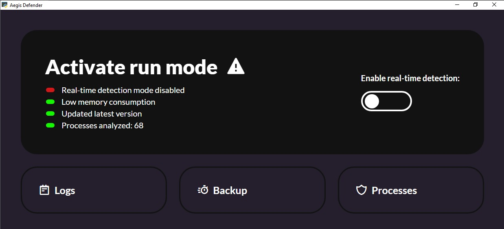

# Aégis Defender - PT-BR

## Version

**Aegis Defender**

* version: 5.1.1
* build_number: 40
* release_date: 2023-09-22
* release_notes:
    - Creating the backup folder with the old interface and the old algorithm;
    - Switching the software language to English;
    - Removing the need to interact with the Google API and Boxicons API, leaving the files locally in the project, making it possible to use the icons and fonts without needing the internet.

## Um Endpoint Detection and Response (EDR) otimizado para Windows

O **Aégis Defender** é uma solução de segurança endpoint desenvolvida para proteger seu sistema contra a crescente ameaça dos ransomwares. Criado com Python e otimizado para sistemas Windows, nosso EDR incorpora algoritmos avançados de aprendizado de máquina, monitoramento em tempo real via WMI (Windows Management Instrumentation) e outras técnicas modernas de defesa em profundidade para oferecer proteção robusta e eficiente.

### Características Principais

- **Machine Learning para Detecção**: Utilizamos algoritmos de aprendizado de máquina para aprimorar a eficácia na detecção de ameaças, permitindo que o sistema se adapte às novas variantes de ransomware.
  
- **Monitoramento em Tempo Real via WMI**: O Aégis Defender faz uso do WMI para monitorar eventos de sistema em tempo real, aumentando nossa capacidade de detecção e resposta imediata a atividades maliciosas.

- **Verificação na Base de Dados JSON**: A base de dados JSON permite uma análise rápida e precisa de arquivos e processos, tornando o sistema mais abrangente que antivírus comuns.

## Pré-requisitos

Para garantir o funcionamento correto do Aégis Defender, é crucial que o ambiente onde ele será executado atenda a certas especificações. Os pré-requisitos abaixo são os mínimos recomendados, baseados em nossos ambientes de teste:

- **Memória**: 2GB de RAM (mínimo)
- **Processador**: 2 cores de CPU (mínimo)

### Sistema Operacional

- **Windows 10 x64**: A versão de 64 bits do Windows 10 é o sistema operacional suportado. É altamente recomendável manter o sistema atualizado com as últimas atualizações de segurança.

### Permissões

- **Acesso Administrativo**: O Aégis Defender requer privilégios de administrador para acessar recursos de sistema essenciais.

### Softwares Adicionais

- **Python Runtime**: É necessário ter Python instalado para executar o código.
- **Atualizações de Segurança**: Certifique-se de que todas as atualizações de segurança e patches estejam instalados.

Note que essas configurações foram as utilizadas em nossos ambientes de teste e servem como um ponto de partida. Configurações de hardware mais robustas são recomendadas para um melhor desempenho.

## Tecnologias

O Aégis Defender foi meticulosamente desenvolvido para operar no ambiente Windows 10, aproveitando as capacidades avançadas oferecidas pela linguagem de programação Python. Abaixo, você encontrará as tecnologias que compõem a espinha dorsal deste projeto:

### Sistema Operacional

- **Windows 10**: O Aégis Defender foi otimizado para operar no Windows 10, tirando vantagem das APIs e recursos nativos oferecidos por este sistema operacional.

### Linguagem de Programação

- **Python**: Linguagem escolhida por sua robustez e facilidade de integração com várias bibliotecas e APIs, permitindo uma rápida prototipagem e desenvolvimento.

### Bibliotecas

A seleção criteriosa de bibliotecas em Python amplifica as funcionalidades do Aégis Defender:

- **os, ctypes, sys**: Essas bibliotecas permitem uma integração profunda com o sistema operacional Windows.
- **tkinter.messagebox**: Utilizada para a criação de diálogos interativos e notificações ao usuário.
- **psutil, wmi**: Empregadas no monitoramento em tempo real dos processos e eventos do sistema.
- **sklearn**: Implementa algoritmos de aprendizado de máquina para uma detecção de ameaças mais precisa.
- **json**: Encarregada do gerenciamento da base de dados JSON, que armazena informações cruciais.
- **webview, win32, time**: Estas bibliotecas são utilizadas para a manipulação da interface de usuário e gerenciamento do tempo.

### Frameworks e APIs

- **Flask**: Este framework é utilizado para desenvolver uma interface web que permite uma fácil interação com o Aégis Defender.
- **MITRE ATT&CK**: Utilizamos as diretrizes e práticas recomendadas do MITRE ATT&CK para melhorar a segurança.
- **Google APIs**: Permite integrações com serviços do Google para funcionalidades adicionais, como armazenamento em nuvem e análise de dados.

## Instalação

### Como baixar nosso aplicativo através do site Aégis Defender

Se você está interessado em baixar e experimentar nosso aplicativo, siga as instruções abaixo para uma experiência tranquila e descomplicada:

1. **Acesse o site**: Primeiro, visite o site do [Aégis Defender](https://aegis.avalontech.net.br). Nosso site foi otimizado para ser fácil de navegar e é compatível com todos os navegadores modernos.
2. **Navegue até o botão de download**: Em nossa página inicial, você encontrará um botão claramente marcado como "Download" ou "Baixar". Este botão foi projetado para ser visível e de fácil acesso.
3. **Inicie o download**: Uma vez que você clique no botão de download, o processo de baixar o arquivo começará automaticamente. Depende da velocidade da sua conexão com a internet, mas, geralmente, leva apenas alguns minutos.
4. **Siga as instruções de instalação**: Após o download ser concluído, abra o arquivo baixado e siga as instruções na tela para instalar nosso aplicativo em seu dispositivo.

Agradecemos por escolher nosso aplicativo e esperamos que você tenha uma excelente experiência ao usá-lo!

## Uso

### Funcionalidades:

1. **Detecção em Tempo Real**:
    - **Como usar**: Após abrir o programa, localize e clique no botão "Iniciar Detecção em Tempo Real".

        

    - **Descrição**: Esta função permite que o software monitore e identifique ameaças ou atividades não usuais em tempo real, garantindo maior segurança para seu sistema.

        

    -**Recomendação**: É aconselhável manter esta função sempre ativada para uma proteção constante.

2. **Logs**:
    - **Como usar**: No menu principal, selecione a opção "Logs". Aqui, você poderá visualizar todos os registros de atividades e detecções.
    - **Descrição**: A função de logs mantém um registro detalhado de todas as atividades detectadas pelo programa, facilitando a revisão e análise de qualquer evento ou incidente.
    - **Dica**: Verifique regularmente os logs para manter-se informado sobre as atividades do seu sistema.

3. **Processos**:
    - **Como usar**: Selecione "Processos" no menu. Aqui, você verá uma lista de todos os processos em execução.
    - **Descrição**: Esta função permite visualizar e gerenciar todos os processos ativos no seu sistema.
    - **Dica**: Se notar algum processo desconhecido ou suspeito, investigue ou encerre-o para garantir a segurança do seu sistema.

        

## Participação da Comunidade e Contribuição

- **Engajamento Comunitário**: O Aégis Defender prioriza o engajamento produtivo e as contribuições da comunidade para assegurar uma solução de segurança de ponta. Portanto, instamos todos os interessados a se envolverem ativamente para melhorar continuamente o software.

    1. **Feedbacks**: Acreditamos que o feedback é uma ferramenta valiosa para aprimoramento. Solicitamos que os usuários forneçam suas opiniões objetivas e construtivas sobre a performance e eficácia do Aégis Defender. Encorajamos a partilha de tais avaliações na seção FAQ do nosso [portal oficial](https://aegis.avalontech.net.br).

    2. **Propostas de Melhorias**: Quaisquer ideias inovadoras ou sugestões que visem ampliar ou melhorar as capacidades do Aégis Defender são bem-vindas. Reconhecemos que a perspectiva de cada usuário pode agregar valor significativo ao projeto.

    3. **Relato de Inconsistências**: Convidamos os usuários a relatarem qualquer falha ou incoerência observada no software. Garantimos que tais feedbacks serão tratados com a máxima seriedade, e esforços serão concentrados para resolver prontamente quaisquer incongruências.

- **Compromisso com a Excelência**: A dedicação conjunta da equipe de desenvolvimento do Aégis Defender e da comunidade é essencial para assegurar a integridade, eficácia e robustez da solução proposta. Agradecemos antecipadamente por todas as contribuições e garantimos que cada uma será avaliada e considerada.

## Avaliações e Testes

- **Metodologia Rigorosa de Testes**: O Aégis Defender foi meticulosamente avaliado mediante metodologias padronizadas e testes rigorosos, garantindo sua capacidade de defesa e resposta.

    1. **Resiliência a Ransomwares**: Parte integral dos testes de avaliação, o Aégis Defender foi submetido a cenários adversos envolvendo alguns dos ransomwares mais notórios no cenário de ameaças cibernéticas. Esta bateria de testes incluiu ameaças como o Wannacry e o Jigsaw, dentre outros. O sucesso obtido diante dessas ameaças é um testemunho da robustez, competência e eficácia da nossa solução.

    2. **Compromisso com a Segurança**: Além dos testes específicos contra ransomwares, o Aégis Defender passa por uma série contínua de avaliações para garantir que mantém sua efetividade frente à evolução constante das ameaças. A cada atualização ou refinamento do software, novos testes são conduzidos para certificar-se de que o nível de proteção oferecido está alinhado às melhores práticas e padrões da indústria.

- **Dedicação à Excelência**: A dedicação incansável da equipe por trás do Aégis Defender é refletida na meticulosidade dos testes realizados e na constante busca por aperfeiçoamento, garantindo aos usuários uma ferramenta confiável e de alta performance.

## Autores

- **Equipe Aégis Defender**: O Aégis Defender representa um marco na segurança cibernética, fruto da colaboração e dedicação de três profissionais distintos:

    - **Júlia Barboza Brunelli**
        - [GitHub](https://github.com/Aykie)
        - [LinkedIn](https://www.linkedin.com/in/aykie/)

    - **Nicholas Calegari Sanches**
        - [GitHub](https://github.com/NCalegariS)
        - [LinkedIn](https://www.linkedin.com/in/nicholas-calegari-258823242/)
        
    - **Renan Dias da Costa Silva**
        - [GitHub](https://github.com/WHrez1ns)
        - [LinkedIn](https://www.linkedin.com/in/renan-dias-da-costa-563830264/)

Cada integrante da equipe contribuiu significativamente para a concepção, design e desenvolvimento deste projeto, consolidando sua relevância no panorama atual de segurança cibernética.

## Agradecimentos

À medida que a evolução digital avança, os desafios no campo da segurança cibernética tornam-se ainda mais intrincados. Dentro desse cenário complexo, a concepção e a realização do Aégis Defender são frutos da combinação sinérgica entre talento, dedicação e colaboração interdisciplinar. Por isso, consideramos imprescindível reconhecer e agradecer a todos que participaram dessa empreitada conosco.

- **Professores da FIAP**: Nos corredores acadêmicos e salas de aula da FIAP, encontramos um ambiente de fomento ao pensamento crítico e inovação. Agradeço aos professores que, com profundo conhecimento e vasta experiência, forneceram orientações precisas, moldando assim a base teórica e prática do Aégis Defender.

- **Pride Security**: Em um mercado tão competitivo e dinâmico, confiar em jovens talentos e desafiar os limites convencionais é uma postura louvável. A Pride Security não apenas nos propôs um desafio, mas também se tornou parte integral do nosso processo de aprendizado e desenvolvimento.

- **Avalon Tech**: A colaboração com a Avalon Tech foi de suma importância para dar vida ao Aégis Defender, e agradecemos o apoio ao projeto.

A jornada do Aégis Defender é testemunha do poder da colaboração. Assim, com humildade e respeito, agradecemos a cada indivíduo e instituição que nos apoiou, direta ou indiretamente, e confiou na nossa visão. Estamos no início de uma trajetória que, esperamos, contribuirá significativamente para a segurança digital.

## Assistência e Suporte Técnico

- **Canais de Comunicação** : Estamos comprometidos em oferecer um suporte eficiente e ágil aos usuários do Aégis. Se você encontrar dificuldades, tiver dúvidas sobre a aplicação ou precisar de orientação técnica:

    1. **Página de Contato**: A primeira opção é visitar a nossa [página de contato no site oficial do Aégis](https://aegis.avalontech.net.br), onde disponibilizamos um formulário para dúvidas e sugestões.
    
    2. **E-mail**: Para um suporte mais direto, não hesite em nos enviar um e-mail. A nossa equipe de suporte técnico está sempre pronta para auxiliar e responderá sua mensagem o mais breve possível.
    
    3. **Documentação e FAQ**: Recomendamos também a consulta à nossa documentação extensiva e à seção de Perguntas Frequentes (FAQ) no site, onde muitas questões comuns são abordadas e esclarecidas.

Esperamos que estas vias de comunicação facilitem sua experiência com o Aégis e garantam a resolução de qualquer inquietação ou obstáculo que possa surgir.

# Aegis Defender - ENG

## Version

**Aegis Defender**

* version: 5.1.1
* build_number: 40
* release_date: 2023-09-22
* release_notes:
    - Creating the backup folder with the old interface and the old algorithm;
    - Switching the software language to English;
    - Removing the need to interact with the Google API and Boxicons API, leaving the files locally in the project, making it possible to use the icons and fonts without needing the internet.

## An Endpoint Detection and Response (EDR) optimized for Windows

The **Aegis Defender** is an endpoint security solution developed to protect your system against the rising threat of ransomwares. Made with Python and optimized for Windows systems, our EDR incorporates advanced machine learning algorithms, real-time monitoring via WMI (Windows Management Instrumentation), and other modern in-depth defense techniques to provide robust and efficient protection.

### Key Features

- **Machine Learning for Detection**: We use machine learning algorithms to enhance the effectiveness in threat detection, allowing the system to adapt to new ransomware variants.

- **Real-time Monitoring via WMI**: Aegis Defender utilizes WMI to monitor system events in real time, increasing our detection capability and immediate response to malicious activities.

- **Verification in JSON Database**: The JSON database allows for quick and accurate analysis of files and processes, making the system more comprehensive than regular antivirus.

## Prerequisites

To ensure the proper functioning of Aegis Defender, it is crucial that the environment in which it will be run meets certain specifications. The prerequisites below are the minimum recommended, based on our test environments:

- **Memory**: 2GB RAM (minimum)
- **Processor**: 2 CPU cores (minimum)

### Operating System

- **Windows 10 x64**: The 64-bit version of Windows 10 is the supported operating system. It is highly recommended to keep the system updated with the latest security patches.

### Permissions

- **Administrative Access**: Aegis Defender requires administrator privileges to access essential system resources.

### Additional Softwares

- **Python Runtime**: Python needs to be installed to run the code.
- **Security Updates**: Ensure that all security updates and patches are installed.

Note that these settings were the ones used in our test environments and serve as a starting point. More robust hardware configurations are recommended for better performance.

## Technologies

Aegis Defender was meticulously developed to operate in the Windows 10 environment, leveraging the advanced capabilities offered by the Python programming language. Below, you will find the technologies that form the backbone of this project:

### Operating System

- **Windows 10**: Aegis Defender has been optimized to run on Windows 10, taking advantage of the APIs and native features provided by this operating system.

### Programming Language

- **Python**: The language was chosen for its robustness and ease of integration with various libraries and APIs, allowing for rapid prototyping and development.

### Libraries

The careful selection of Python libraries amplifies the functionalities of Aegis Defender:

- **os, ctypes, sys**: These libraries allow for deep integration with the Windows operating system.
- **tkinter.messagebox**: Used for creating interactive dialogs and user notifications.
- **psutil, wmi**: Employed in the real-time monitoring of system processes and events.
- **sklearn**: Implements machine learning algorithms for more precise threat detection.
- **json**: Tasked with managing the JSON database, which stores crucial information.
- **webview, win32, time**: These libraries are used for user interface manipulation and time management.

### Frameworks and APIs

- **Flask**: This framework is used to develop a web interface that allows for easy interaction with Aegis Defender.
- **MITRE ATT&CK**: We utilize the guidelines and best practices from MITRE ATT&CK to enhance security.
- **Google APIs**: Allows integrations with Google services for additional functionalities such as cloud storage and data analysis.

## Installation

### How to download our app through the Aegis Defender website

If you're interested in downloading and trying out our app, follow the instructions below for a smooth and uncomplicated experience:

1. **Visit the website**: First, navigate to the [Aegis Defender](https://aegis.avalontech.net.br) website. Our website has been optimized for easy navigation and is compatible with all modern browsers.
2. **Locate the download button**: On our homepage, you'll find a button clearly labeled as "Download". This button has been designed to be conspicuous and easily accessible.
3. **Initiate the download**: Once you click on the download button, the process of downloading the file will automatically commence. Depending on your internet connection speed, this usually takes just a few minutes.
4. **Follow installation instructions**: After the download is complete, open the downloaded file and follow the on-screen instructions to install our app on your device.

Thank you for choosing our app, and we hope you have a great experience using it!

## Usage

### Features:

1. **Real-Time Detection**:
    - **How to use**: After launching the program, locate and click on the "Start Real-Time Detection" button.
    

    - **Description**: This function allows the software to monitor and identify threats or unusual activities in real-time, ensuring greater security for your system.
    
    - **Recommendation**: It's advisable to always keep this function activated for continuous protection.

2. **Logs**:
    - **How to use**: In the main menu, select the "Logs" option. Here, you can view all the activity and detection records.
    - **Description**: The logs function keeps a detailed record of all activities detected by the program, making it easier to review and analyze any event or incident.
    - **Tip**: Regularly check the logs to stay informed about your system's activities.

3. **Processes**:
    - **How to use**: Select "Processes" from the menu. Here, you'll see a list of all running processes.
    - **Description**: This function allows you to view and manage all active processes on your system.
    - **Tip**: If you notice any unknown or suspicious processes, investigate or terminate them to ensure your system's safety.

        

    ## Community Participation and Contribution

- **Community Engagement**: Aégis Defender prioritizes productive engagement and contributions from the community to ensure cutting-edge security solutions. Therefore, we urge all interested parties to actively get involved in continuously improving the software.

    1. **Feedback**: We believe feedback is a valuable tool for enhancement. We ask users to provide their objective and constructive opinions on Aégis Defender's performance and efficacy. We encourage sharing such reviews on the FAQ section of our [official portal](https://aegis.avalontech.net.br).
  
    2. **Improvement Proposals**: Any innovative ideas or suggestions aiming to expand or enhance Aégis Defender's capabilities are welcome. We recognize that every user's perspective can add significant value to the project.
  
    3. **Reporting Inconsistencies**: We invite users to report any flaws or inconsistencies observed in the software. We assure you that such feedback will be treated with the utmost seriousness, and efforts will be concentrated to promptly resolve any discrepancies.

- **Commitment to Excellence**: The combined dedication of Aégis Defender's development team and the community is essential in ensuring the integrity, efficacy, and robustness of the proposed solution. We deeply appreciate all contributions and assure that each will be evaluated and considered.

## Reviews and Tests

- **Rigorous Testing Methodology**: Aégis Defender underwent meticulous evaluation using standardized methodologies and stringent tests, ensuring its defense and response capability.
  
    1. **Resilience against Ransomware**: An integral part of the assessment tests, Aégis Defender was subjected to adverse scenarios involving some of the most notorious ransomware in the cyber threat landscape. This test suite included threats such as Wannacry and Jigsaw, among others. The success against these threats stands as a testament to the robustness, competence, and efficacy of our solution.
  
    2. **Commitment to Security**: Beyond specific ransomware tests, Aégis Defender undergoes continuous evaluations to ensure it maintains its effectiveness against the ever-evolving threats. With every software update or refinement, new tests are conducted to make sure the protection level offered aligns with the best practices and standards in the industry.

- **Dedication to Excellence**: The tireless dedication of the team behind Aégis Defender is reflected in the meticulousness of tests conducted and the constant pursuit of refinement, assuring users a reliable, high-performance tool.

## Authors

- **Aégis Defender Team**: Aégis Defender marks a milestone in cybersecurity, the fruit of the collaboration and dedication of three distinct professionals:

    - **Júlia Barboza Brunelli**
        - [GitHub](https://github.com/Aykie)
        - [LinkedIn](https://www.linkedin.com/in/aykie/)

    - **Nicholas Calegari Sanches**
        - [GitHub](https://github.com/NCalegariS)
        - [LinkedIn](https://www.linkedin.com/in/nicholas-calegari-258823242/)
        
    - **Renan Dias da Costa Silva**
        - [GitHub](https://github.com/WHrez1ns)
        - [LinkedIn](https://www.linkedin.com/in/renan-dias-da-costa-563830264/)

Each team member made a significant contribution to the conception, design, and development of this project, consolidating its relevance in the current cybersecurity landscape.

## Acknowledgements

As digital evolution progresses, challenges in the cybersecurity field become even more intricate. Within this complex scenario, the conception and realization of Aégis Defender are the fruits of a synergistic blend of talent, dedication, and interdisciplinary collaboration. For this reason, we deem it essential to acknowledge and thank everyone who embarked on this journey with us.

- **FIAP Professors**: In the academic corridors and classrooms of FIAP, we found an environment conducive to critical thinking and innovation. We thank the professors who, with profound knowledge and vast experience, provided precise guidance, thus shaping the theoretical and practical foundation of Aégis Defender.

- **Pride Security**: In such a competitive and dynamic market, trusting in young talents and challenging conventional boundaries is a commendable stance. Pride Security not only set us a challenge but also became an integral part of our learning and development process.

- **Avalon Tech**: The collaboration with Avalon Tech was paramount in bringing Aégis Defender to life, and we appreciate the project's support.

The Aégis Defender journey bears witness to the power of collaboration. Thus, with humility and respect, we thank each individual and institution that supported us, directly or indirectly, and trusted in our vision. We are at the beginning of a journey that, we hope, will make a significant contribution to digital security.